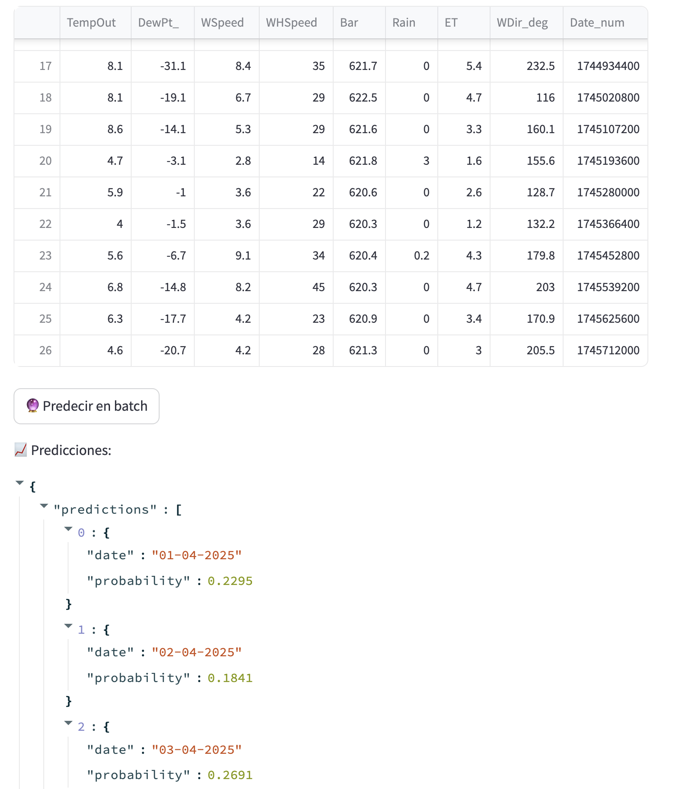

# 🛠 Proyecto Airflow + MinIO + ML Pipeline

Este proyecto orquesta un flujo completo de procesamiento de datos y entrenamiento de modelos de Machine Learning usando **Apache Airflow**, con almacenamiento de datos en **MinIO (S3 compatible)** y tracking de experimentos en **MLflow**. Todo está dockerizado y configurado para correr automáticamente.

---

## 📦 Estructura del Proyecto

```
.
├── dags/                   # DAGs de Airflow
├── fastapi_app/             # App de FastAPI para servir el modelo
│   ├── app.py               # API principal
│   ├── Dockerfile           # Contenedor streamlit
│   ├── requirements.txt           # requerimientos del contenedor
│   ├── datos_actuales.ipynb       # Jupyter Notebook para testear la API
├── streamlit_app_app/             # App de FastAPI para servir el modelo
│   ├── app.py               # App principal
│   ├── Dockerfile           # Contenedor streamlit
│   ├── requirements.txt           # requerimientos del contenedor
│   ├── Dockerfile           # Contenedor streamlit
│   ├── data.csv             # datos para probar la app en modo batch
├── mlflow/                  # Carpeta local para MLflow tracking
├── docker-compose.yml       # Definición de servicios
└── .gitignore               # Ignorar archivos temporales
```

---

## 🔁 Flujo del DAG principal (`descargar_y_ver_dataset`)

1. **`probar_minio`**
   - Crea bucket `respaldo2` si no existe en MinIO.

2. **`descargar_dataset`**
   - Descarga dataset desde Google Drive.
   - Lo sube a MinIO en `respaldo2/dataset.csv`.

3. **`procesar_dataset`**
   - Limpieza y preprocesamiento del dataset descargado.
   - Carga el backup como JSON en MinIO (`dataset_backup.json`).

4. **`split_dataset_minio`**
   - Realiza el split `train/test` desde el JSON de MinIO.
   - Guarda `X_train.json`, `X_test.json`, `y_train.json`, `y_test.json` en `respaldo2/splits/`.

5. **Modelado y entrenamiento**:
   - **`train_lightgbm_optuna_minio`**: entrena usando Optuna y sube el modelo.
   - **`train_randomforest_optuna_minio`**: entrena usando Optuna y sube el modelo.
   - **`train_logisticregression_optuna_minio`**: entrena usando Optuna y sube el modelo.
   - **`train_knn_optuna_minio`**: entrena usando Optuna y sube el modelo.

6. **`seleccionar_mejor_modelo`**
   - Evalúa todos los experimentos en MLflow según la métrica **Recall**.
   - Selecciona el mejor modelo.
   - Descarga su `pkl` y lo sube a MinIO en la carpeta `best_model/` (con timestamp en el nombre).

7. **`predict_datos_actuales`**
   - Se conecta con una API para tomar datos actuales.
   - Genera un dataset que pueda probado con el mejor modelo.
   - Devuelve las predicciones en modo Batch en un print en el log.

8. **`test_fastapi_endpoints`**
   - Se crearon 2 endpoint en FastApi, mono manual y modo batch.
   - Esta tarea testea los endpoints con datos actuales.
   - Se imprime en el log la prueba de FastApi.

---

## 🌐 MinIO (S3 Compatible)

- **Console**: [http://localhost:9001](http://localhost:9001)
- **API**: [http://localhost:9000](http://localhost:9000)
- **Usuario/Contraseña**: `minio_admin/minio_admin`
- **Bucket**: `respaldo2`

  

Airflow usa esta conexión:

```yaml
AIRFLOW_CONN_MINIO_S3=s3://minio_admin:minioa_dmin@minio:9000/?endpoint_url=http%3A%2F%2Fminio%3A9000
```

---

## 🧠 MLflow

- **Tracking Server**: [http://localhost:5001](http://localhost:5001)
- **Almacenamiento**: `./mlflow`
- **Base de datos**: SQLite (`mlflow/mlflow.db`)
  
---
## 🐍 FastAPI para servir modelos

- **App**: Corre en `http://localhost:8000`
- **Documentación Swagger**: `http://localhost:8000/docs`

### Endpoints disponibles
  
- **POST** `/predict`
  - Recibe un único registro para predecir.
  - **Ejemplo de input**:
```json
{
    "TempOut": 10.5,
    "DewPt_": -3.2,
    "WSpeed": 5.7,
    "WHSpeed": 30.0,
    "Bar": 622.1,
    "Rain": 0.0,
    "ET": 4.2,
    "WDir_deg": 154.5,
    "Date_num": 1743465600.0
}
```

- **POST** `/predict_batch`
  - Recibe varios registros en formato lista.
  - **Ejemplo de input**:
```json
[
  {
    "TempOut": 10.5,
    "DewPt_": -3.2,
    "WSpeed": 5.7,
    "WHSpeed": 30.0,
    "Bar": 622.1,
    "Rain": 0.0,
    "ET": 4.2,
    "WDir_deg": 154.5,
    "Date_num": 1743465600.0
  },
  {
    "TempOut": 9.8,
    "DewPt_": -2.1,
    "WSpeed": 6.0,
    "WHSpeed": 35.0,
    "Bar": 621.5,
    "Rain": 0.0,
    "ET": 4.5,
    "WDir_deg": 120.5,
    "Date_num": 1743552000.0
  }
]
```

- **Respuesta**:
```json
{'probability': [0.2591254417393721]}
```

```json
{'predictions': [{'date': '01-04-2025', 'probability': 0.2295}, {'date': '02-04-2025', 'probability': 0.1841}, {'date': '03-04-2025', 'probability': 0.2691}, {'date': '04-04-2025', 'probability': 0.164}, {'date': '05-04-2025', 'probability': 0.0861}, {'date': '06-04-2025', 'probability': 0.2048}, {'date': '07-04-2025', 'probability': 0.2271}, {'date': '08-04-2025', 'probability': 0.29}, {'date': '09-04-2025', 'probability': 0.2254}, {'date': '10-04-2025', 'probability': 0.2329}, {'date': '11-04-2025', 'probability': 0.1346}, {'date': '12-04-2025', 'probability': 0.1463}, {'date': '13-04-2025', 'probability': 0.1244}, {'date': '14-04-2025', 'probability': 0.0936}, {'date': '15-04-2025', 'probability': 0.1521}, {'date': '16-04-2025', 'probability': 0.1187}, {'date': '17-04-2025', 'probability': 0.2921}, {'date': '18-04-2025', 'probability': 0.1584}, {'date': '19-04-2025', 'probability': 0.1557}, {'date': '20-04-2025', 'probability': 0.227}, {'date': '21-04-2025', 'probability': 0.2463}, {'date': '22-04-2025', 'probability': 0.2717}, {'date': '23-04-2025', 'probability': 0.3901}, {'date': '24-04-2025', 'probability': 0.1684}, {'date': '25-04-2025', 'probability': 0.065}, {'date': '26-04-2025', 'probability': 0.25}, {'date': '27-04-2025', 'probability': 0.2017}]}
```


### 🔄 Actualización Dinámica del Modelo

Cada vez que la app FastAPI se inicia:
- Busca automáticamente el último modelo `.pkl` en el bucket MinIO `respaldo2/best_model/`
- Carga el modelo al inicio (`@app.on_event('startup')`).


## 🚀 Para levantar todo

```bash
docker-compose up --build
```

Accesos:
- **Airflow**: [http://localhost:8080](http://localhost:8080)
- **FastAPI**: [http://localhost:8000/docs](http://localhost:8000/docs)
- **MinIO Console**: [http://localhost:9001](http://localhost:9001)
- **MLflow Tracking**: [http://localhost:5001](http://localhost:5001)
- **Streamlit APP**: [http://localhost:8501](http://localhost:8501)


## 🔧 Servicios Docker

| Servicio         | Puerto Expuesto | Descripción                  |
|------------------|------------------|-------------------------------|
| Airflow Webserver | 8080             | UI de Airflow                  |
| Airflow Scheduler | 8080             | Scheduler de Airflow           |
| Airflow Worker    | 8080             | Workers de Airflow             |
| MinIO             | 9000, 9001        | API y consola de MinIO         |
| PostgreSQL        | 5432             | Base de datos de Airflow       |
| Redis             | 6379             | Broker de Airflow              |
| MLflow            | 5001             | Tracking server de MLflow      |
| FastAPI           | 8000             | API REST para predicciones     |
| Streamlit         | 8501             | Aplicacion para usar el modelo     |

## 🎨 Streamlit App

La aplicación **Streamlit** permite a los usuarios **interactuar de forma gráfica** con el modelo de Machine Learning servido por FastAPI:

- **Modo Individual**:
  - El usuario puede completar **manual** un formulario con las variables de entrada (`TempOut`, `DewPt`, `WSpeed`, `WHSpeed`, etc.).
  - Luego, puede enviar esos datos y obtener una predicción instantánea usando el endpoint `/predict`.

- **Modo Batch**:
  - Permite **subir un archivo CSV** con múltiples registros a predecir.
  - El backend consulta al endpoint `/predict_batch` y muestra el resultado de cada predicción.
  - También convierte automáticamente el campo `Date_num` (timestamp) a una fecha amigable en formato `dd-mm-yyyy` junto a la probabilidad estimada.

### ⚙️ Características principales:

- 📥 Carga manual de variables.
- 📄 Subida de archivos `.csv`.
- 📊 Visualización de probabilidades por fecha.
- ⚡ Rápida conexión a la API.
- 📅 Conversión automática de `Date_num` a fecha humana.

---

### 🖥️ Capturas de Pantalla (sugerido)

> *(Podés agregar capturas en una carpeta `capturas/` dentro del repo, y luego insertarlas así:)*

- **Formulario Manual:**
  
  
  

- **Carga de CSV y Predicciones Batch:**

  
  

---

### 🚀 Cómo levantar la app de Streamlit

La app de Streamlit está totalmente dockerizada. Para levantarla:

```bash
docker-compose up --build
---

💭 *Proyecto de referencia integrando orquestación, almacenamiento, tracking de modelos y APIs de inferencia en producción.*

